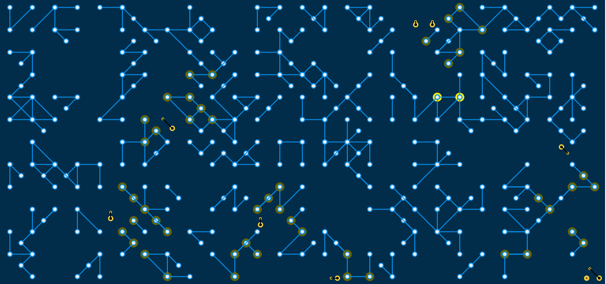

# GridWeaver
A geometric animation that animates squares moving at right angles to the vertical and horizontal axes in an enclosed space.   
Please view a live demo at : https://codepen.io/redutron/pen/GROBEPz 

## Getting Started

These instructions will get you a copy of the project up and running on your local machine for development and testing purposes.

### Prerequisites

All you'll ever need is a working web browser. That's it.

### Installing
Open the index.html file in your web browser. It's that simple.

## Built With

* Vanilla Javascript
* p5.js   

## Authors

* **Caleb Nii Tetteh Tsuru Addy**

## License

This project is licensed under the GNU General Public License v3.0.
